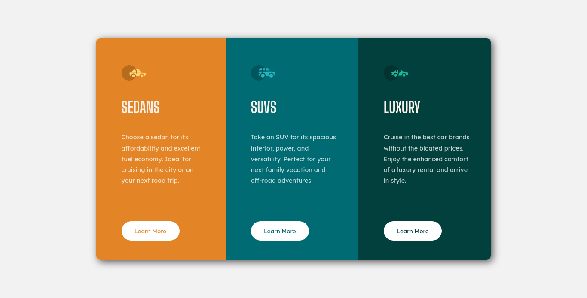

# Frontend Mentor - QR Code Component Solution!

This is a solution to the [3-column preview card component on Frontend Mentor](https://www.frontendmentor.io/challenges/3column-preview-card-component-pH92eAR2-). Frontend Mentor challenges help you improve your coding skills by building realistic projects.

## Table of contents

- [Overview](#overview)
  - [Screenshot](#screenshot)
  - [Links](#links)
  - [Built with](#built-with)
  - [What I learned](#what-i-learned)
  - [CSS code](#css)
  - [Useful resources](#useful-resources)
- [Author](#author)
- [Acknowledgments](#acknowledgments)

## Overview

### Screenshot

### Desktop



### Mobile


### Links

- Solution URL: (https://github.com/kentbuno/3-Column-Preview-Card-)
- Live Site URL: (https://3-column-preview-card-sigma.vercel.app/)

### Built with

- Semantic HTML5 markup
- CSS custom properties
- Flexbox

### What I learned

I learned more about flexbox, box-shadow, and other properties that I'm using;

When it comes to difficulty, I had a hard time with pixel sizes, but overall it's a fun challenge.

Any comments about my code are well appreciated and will be implemented.

## CSS

```css
/*--- Reset default values ---*/
*,
*::before,
*::after {
  box-sizing: border-box;
}

body,
h1,
h2,
h3,
h4,
p,
li,
figure,
figcaption,
blockquote,
dl,
dd {
  margin: 0;
}

html:focus-within {
  scroll-behavior: smooth;
}

img {
  max-width: 100%;
  display: inline-block;
}

:root {
  --primary-font: "Big Shoulders Display", cursive;
  --secondary-font: "Lexend Deca", sans-serif;
  --sedans-bg: hsl(30, 77%, 52%);
  --suvs-bg: hsl(185, 98%, 23%);
  --luxury-bg: hsl(177, 94%, 13%);
  --header-color: hsl(26, 57%, 95%);
  --paragraph-color: hsla(0, 0%, 100%, 0.75);
  --body-bg: hsl(0, 0%, 95%);
}

/*--- Global Styling ---*/
body {
  min-height: 100vh;
  display: flex;
  align-items: center;
  justify-content: center;
  background-color: var(--body-bg);
}

main {
  width: 20.3125rem;
  margin-block: 5.3125rem;
  box-shadow: 5px 5px 20px rgb(85, 81, 81);
  border-radius: 0.625rem;
  overflow: hidden;
}

h1 {
  padding-block: 2.5rem;
  font-family: var(--primary-font);
  font-size: 2.5rem;
  text-transform: uppercase;
  color: var(--header-color);
}

p {
  font-family: var(--secondary-font);
  font-size: 0.9375rem;
  color: var(--paragraph-color);
  line-height: 1.75;
}

section {
  padding: 2.8125rem 3.125rem;
}

a {
  text-decoration: none;
}

/*--- Class Styling ---*/
.sedans-section {
  background-color: var(--sedans-bg);
}

.suvs-section {
  background-color: var(--suvs-bg);
}

.luxury-section {
  background-color: var(--luxury-bg);
}

.more-info {
  width: 9.375rem;
  height: 3.125rem;
  display: grid;
  place-items: center;
  background-color: white;
  border-radius: 3.125rem;
  margin-top: 1.5625rem;
  text-decoration: none;
  font-family: var(--secondary-font);
  font-size: 0.9375rem;
  transition: all 500ms ease;
}

.sedans-more a {
  color: var(--sedans-bg);
}

.suvs-more a {
  color: var(--suvs-bg);
}

.luxury-more a {
  color: var(--luxury-bg);
}

.no-wrap {
  white-space: nowrap;
}

/*--- Hover State ---*/
@media (hover: hover) {
  .more-info:hover {
    cursor: pointer;
    transform: scale(1.1);
    border: 2px solid white;
  }
  .more-info:hover a {
    color: white;
  }
  .sedans-more:hover {
    background-color: var(--sedans-bg);
  }
  .suvs-more:hover {
    background-color: var(--suvs-bg);
  }
  .luxury-more:hover {
    background-color: var(--luxury-bg);
  }
}

/*--- Desktop Layout ---*/
@media only screen and (min-width: 1020px) {
  main {
    display: flex;
    width: 63.75rem;
    margin: auto;
  }
  p {
    font-size: 1rem;
  }
  section {
    padding: 4.375rem 3.125rem 3.125rem 4.0625rem;
  }
  h1 {
    padding: 2.5rem 0rem;
  }

  .more-info {
    margin-top: 5.625rem;
  }
}
```

### Useful resources

- [W3Schools](https://www.w3schools.com/w3css/defaulT.asp) - This helped me when I forget some css properties.
- [A Modern CSS Reset](https://piccalil.li/blog/a-modern-css-reset/) - This helped me on resetting default properties.

## Author

- Frontend Mentor - [@kentbuno](https://www.frontendmentor.io/profile/kentbuno)

## Acknowledgments

I want to personally thank the [Frontend Mentor](https://www.frontendmentor.io/home) website because it helps me learn and helps my learning journey enjoyable.

I also want to thank the people who commented on my previous challenge for their suggestions. I really appreciate them. 😊
